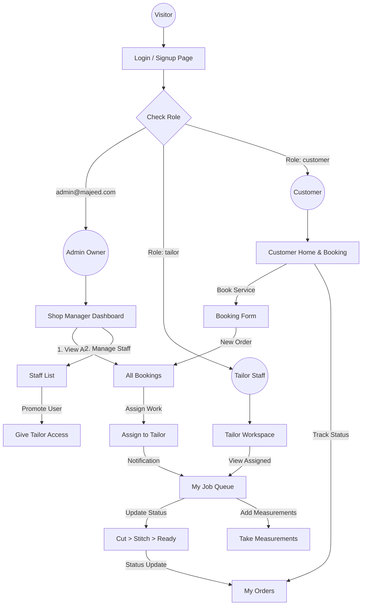

# Majeed Elite Tailor - App Flow & Architecture

## System Overview
The application is designed for a "Big Shop" environment with three distinct roles:
1.  **Shop Owner (Admin)**: Full control, staff management, order assignment.
2.  **Tailor (Staff)**: Focused view for cutting/stitching assigned orders.
3.  **Customer**: Browsing, booking, and tracking orders.

## Visual Flowchart

## Detailed Role Workflows

### 1. The "Promotion" Flow (Onboarding Staff)
*Security Note: Staff accounts are regular user accounts promoted by the Admin.*
1.  **Worker Signs Up**: The new employee signs up as a regular user (e.g., `ali@gmail.com`).
2.  **Admin Login**: Shop owner logs in.
3.  **Promote**: Go to `Manage Staff`, find "Ali", and click **"Promote to Tailor"**.
4.  **Access Granted**: Ali now sees the "Tailor Workspace" when he logs in.

### 2. The Order Lifecycle
1.  **Placement**: Customer books a "Suit Stitching" appointment.
2.  **Assignment**: Admin sees the order, checks who is free, and assigns it to "Master Raza".
3.  **Processing**: Master Raza sees it in his list. He takes measurements, then updates status to **Cutting** -> **Stitching**.
4.  **Completion**: Master Raza marks it as **Ready**.
5.  **Delivery**: Admin marks it as **Delivered** when customer picks it up.
